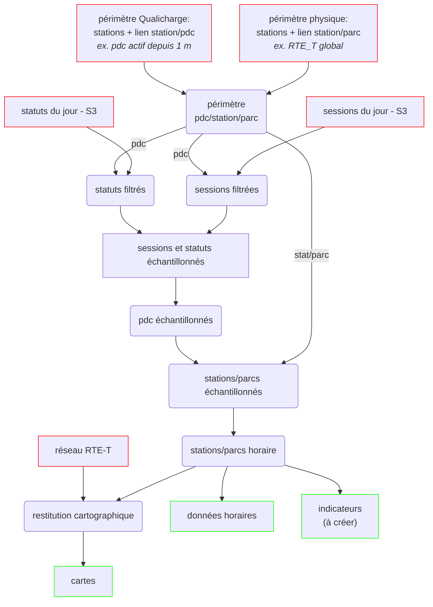

# Calcul des états dynamiques des stations et parcs de recharge

## Description

Le calcul de ces états dynamiques fait référence aux [indicateurs d'usage](https://github.com/loco-philippe/IRVE/blob/main/sources/status%20et%20sessions/indicateurs_usage.md) définis pour Qualicharge.

Le document présente le mode de calcul mis en oeuvre.

Il fait référence également à la structure des données de Qualicharge (voir le document ["comprendre les données Qualicharge"](https://github.com/MTES-MCT/qualicharge/blob/add-modele-documentation/docs/modele.md) )

## Principes généraux

Les états des points de recharge, stations et parcs sont calculés à partir d'un échantillonage des sessions et des statuts.

### Echantillonage des sessions et statuts

La durée d'échantillonage doit être inférieure à la durée de cumul retenue pour les indicateurs (ex. 1 mn ou 5 mn).

Les états d'une session ou d'un statut d'une durée inférieure au double de la durée d'échantillonage ne sont pas pris en compte (cf théorème de Shannon).

### Détermination des états des points de recharge

Les sessions (plus fiables que les statuts) sont utilisées en priorité par rapport aux statuts pour déterminer les états "désactivé" et "occupe".

L'état d'un pdc est calculé en comparant les états des statuts et sessions :

- "désactivé" : s'il n'y a eu aucune session pendant une période longue (ex. 1 mois)
- sinon "occupé" : si une session est en cours
- sinon "hors_service" : si le statut est avec un `etat_pdc` "hors_service"
- sinon "libre" : en complément des autres états

*NOTA :*

- le statut "inconnu" n'est pas pris en compte (on attend un changement d'état explicite),
- en cas de chevauchement entre une période "occupe" et "hors_service", la période "occupe" est prioritaire.

### Détermination des états des stations et parcs

L'état des stations et parcs est calculé à partir de l'état des points de recharge.

La méthode consiste à aggréger pour chaque pas de temps l'état des points de recharge définis au paragraphe précédent :

- "désactivé" : si tous les pdc sont dans l'état "desactive",
- sinon "hs" : si aucun pdc n'est dans l'état "libre" ou "occupe" et si au moins un pdc est dans l'état "hors_service",
- sinon "inactif" : si aucun pdc n'est dans l'état "occupe",
- sinon "saturé" : si très peu de pdc (ex. moins de 10 %) est dans l'état "libre",
- sinon "surchargé" : si peu de pdc (ex. moins de 20 %) est dans l'état "libre",
- sinon "actif" : complément des autres états

### Calcul des indicateurs historisés

Les indicateurs historisés sont calculés quotidiennement dans une même fonction qui réalise les opérations suivantes :

- extraction des sessions et statuts à traiter pour un périmètre physique (liste de points de recharge) et un périmètre temporel (journée)
- suppression des états des statuts et sessions d'une durée inférieure au double de la durée d'échantillonage
- échantillonnage et calcul des états des points de recharge
- calcul des états échantillonés des stations
- calcul des temps cumulés pour chaque état pour les points de recharge et les stations
- génération des indicateurs à partir de ces temps cumulés

Le temps de cumul retenu est d'une heure (découpage d'une journée en 24 tranches horaires).

### Mode de calcul

### Données d'entrée

Périmètre physique : RTET-T

- 2 DataFrame contenant les noeuds et les tronçons du réseau RTET
- 1 DataFrame contenant les liens stations - parcs

Périmètre Qualicharge :

- DataFrame statique : données statiques des pdc

S3 :

- sessions et statuts

### Données de sortie

Données horaires :

- Dataframe contenant les champs :
  - temporel : periode(date), periode_h(heure),
  - puissance : p_cum, p_max,
  - caractéristiques : id, nb_pdc,
  - cumul temporel par état : hs, actif, inactif, sature, surcharge
  - etat booléen : surcharge_h, sature_h

Cartes :

- fichiers html contenant les cartes animées

Indicateurs :

- à réaliser
